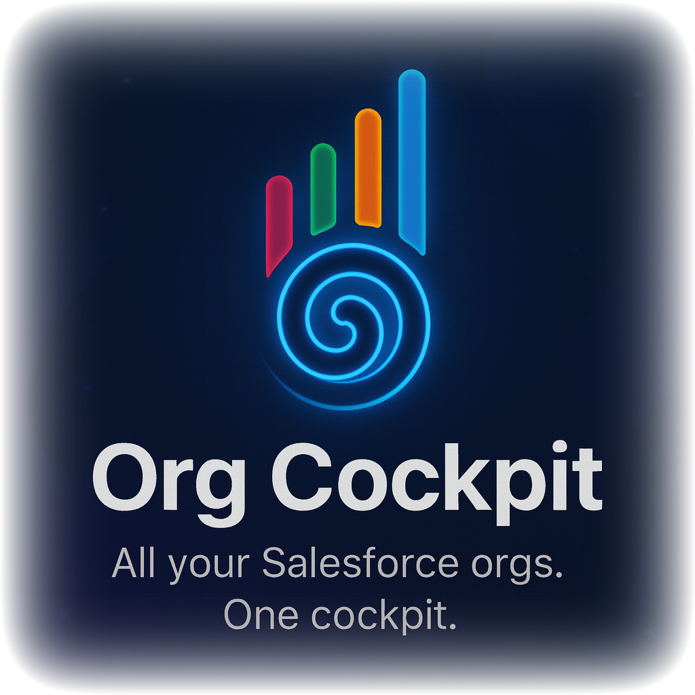

<p align="center">
  
</p>
<p align="center">
  
  
  
  
  
  
  
</p>


Org Cockpit is a cross-platform desktop application for Salesforce developers and administrators.
It provides a clean and efficient UI for managing many Salesforce orgs using the Salesforce CLI (sf).
The app runs on Electron with a Svelte (Vite) frontend and communicates with the sf CLI via IPC.

Org Cockpit removes the need to remember aliases or constantly run CLI commands by giving you a unified view of all authorized orgs.

---

## Features

- Lists all authorized orgs using `sf org list --json`
- Groups orgs by My Domain namespace (example: cms1, cmsapps)
- Accordion sections showing:
  - Production orgs
  - Sandbox orgs
  - Scratch orgs (separate section)
  - Ungrouped orgs
- Connection status indicator with green/red dots
- Shows last used timestamp when available
- Button to open an org in the browser (`sf org open`)
- Ability to add orgs with:
  - Production login
  - Sandbox login (test.salesforce.com)
  - Custom domain login (full My Domain URL)
- Live search filtering by alias or instance URL
- Built with Electron + Svelte (Vite) + electron-builder

---

## Project Structure

```
.
├─ main/                     # Electron main process and IPC
│  ├─ main.js
│  └─ preload.js
├─ frontend/                 # Svelte (Vite) renderer
│  ├─ src/
│  │  ├─ lib/
│  │  │  ├─ api/             # IPC client and shared types
│  │  │  ├─ components/      # UI components
│  │  │  └─ orgs/            # Shared org state (stores/derived data)
│  └─ dist/                  # Built UI (generated by Vite)
├─ package.json
└─ README.md
```

---

## Prerequisites

- Node.js (LTS recommended)
- npm
- Salesforce CLI installed and on PATH
  - The app auto-detects sf in:
    - /usr/local/bin/sf
    - /opt/homebrew/bin/sf
    - ~/.nvm/versions/node/*/bin/sf
    - or falls back to sf in PATH

---

## Installation

Clone the repository:

```bash
git clone <your-repo-url> org-cockpit
cd org-cockpit
```

Install root dependencies:

```bash
npm install
```

Install frontend dependencies:

```bash
cd frontend
npm install
cd ..
```

---

## Development

Start both the Vite dev server and Electron simultaneously:

```bash
npm run dev
```

This will:

- Run the Svelte/Vite development server on http://localhost:5173
- Start Electron with NODE_ENV=DEV
- Load the dev server inside the Electron window

Note: Opening http://localhost:5173 in a regular browser is fine for layout preview, but IPC-based features (sf integration) will not function outside Electron.

To type-check from the frontend folder:

```bash
cd frontend
npm run check
```

That runs `svelte-check` with `tsconfig.app.json` and `tsc -p tsconfig.node.json`. You may see a harmless warning about extending `.svelte-kit/tsconfig.json` if the SvelteKit build output hasn’t been generated locally.

---

## Build the Frontend

To build the Svelte frontend only:

```bash
npm run build
```

This generates the production UI in:

```
frontend/dist/
```

Electron will load these files when packaged.

---

## Packaging the Application

Org Cockpit uses electron-builder to generate distributable applications.

### Build for macOS

```bash
npm run dist:mac
```

Produces:

- A .app bundle
- A .dmg installer (depending on config)
- Output in the release/ directory

### Build for Windows

```bash
npm run dist:win
```

Produces:

- A Windows installer (NSIS .exe)

Note: Building Windows binaries from macOS requires additional setup (Wine, Mono) and is not recommended unless necessary.

### Build all targets (if supported)

```bash
npm run dist:all
```

Script summary (root):

- `npm run dev`: Vite dev server + Electron
- `npm run build`: Build frontend (Vite)
- `npm run dist:mac|win|all`: Build frontend then package with electron-builder

---

## Notes

- During development, Electron loads the Vite dev server.
- In production builds, Electron loads `frontend/dist/index.html`.
- All Salesforce commands are executed through the sf CLI via child process.
- The sf binary detection logic ensures compatibility with macOS Homebrew, manual installations, and NVM-managed Node installations.
- Shared org state (stores/derived data and actions) lives in `frontend/src/lib/orgs/orgState.ts`.
- API types (including `SfOrg`, `OrgListResult`, `AddOrgMode`) are centralized in `frontend/src/lib/api/types.ts` and re-exported from `frontend/src/lib/api.ts`.

---

## License

Copyright 2025 Toby Curtis

Permission is hereby granted, free of charge, to any person obtaining a copy of this software and associated documentation files (the “Software”), to deal in the Software without restriction, including without limitation the rights to use, copy, modify, merge, publish, distribute, sublicense, and/or sell copies of the Software, and to permit persons to whom the Software is furnished to do so, subject to the following conditions:

The above copyright notice and this permission notice shall be included in all copies or substantial portions of the Software.

THE SOFTWARE IS PROVIDED “AS IS”, WITHOUT WARRANTY OF ANY KIND, EXPRESS OR IMPLIED, INCLUDING BUT NOT LIMITED TO THE WARRANTIES OF MERCHANTABILITY, FITNESS FOR A PARTICULAR PURPOSE AND NONINFRINGEMENT. IN NO EVENT SHALL THE AUTHORS OR COPYRIGHT HOLDERS BE LIABLE FOR ANY CLAIM, DAMAGES OR OTHER LIABILITY, WHETHER IN AN ACTION OF CONTRACT, TORT OR OTHERWISE, ARISING FROM, OUT OF OR IN CONNECTION WITH THE SOFTWARE OR THE USE OR OTHER DEALINGS IN THE SOFTWARE.
